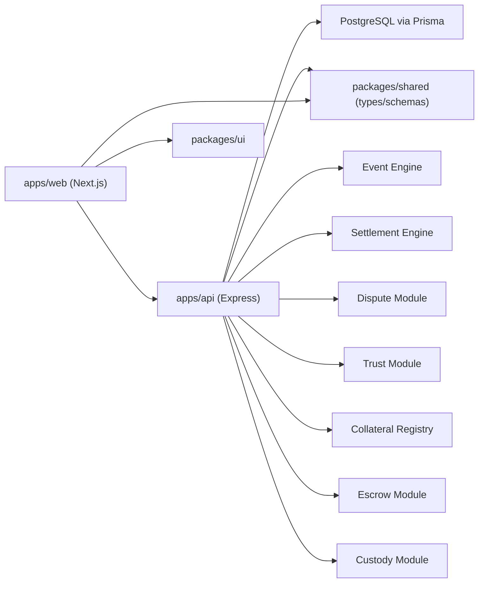
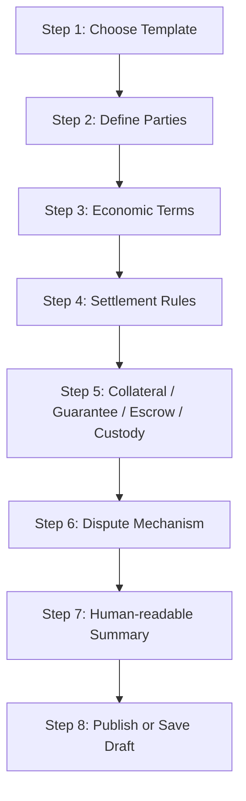

# Sponsum MVP Architecture

## System Diagram

```mermaid
flowchart LR
  WEB["apps/web (Next.js)"] --> API["apps/api (Express)"]
  API --> DB["PostgreSQL via Prisma"]
  API --> SHARED["packages/shared (types/schemas)"]
  WEB --> SHARED
  WEB --> UI["packages/ui"]
  API --> EVT["Event Engine"]
  API --> SET["Settlement Engine"]
  API --> DSP["Dispute Module"]
  API --> TR["Trust Module"]
  API --> COL["Collateral Registry"]
  API --> ESC["Escrow Module"]
  API --> CUS["Custody Module"]
```

## Wizard UX Flow

```mermaid
flowchart TD
  S1["Step 1: Choose Template"] --> S2["Step 2: Define Parties"]
  S2 --> S3["Step 3: Economic Terms"]
  S3 --> S4["Step 4: Settlement Rules"]
  S4 --> S5["Step 5: Collateral / Guarantee / Escrow / Custody"]
  S5 --> S6["Step 6: Dispute Mechanism"]
  S6 --> S7["Step 7: Human-readable Summary"]
  S7 --> S8["Step 8: Publish or Save Draft"]
```
